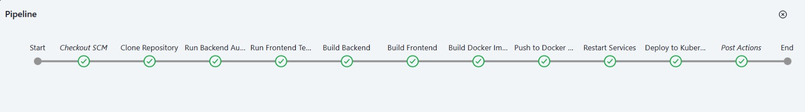
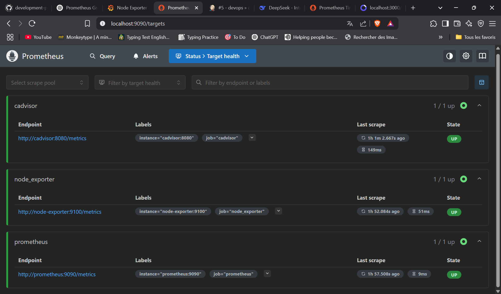
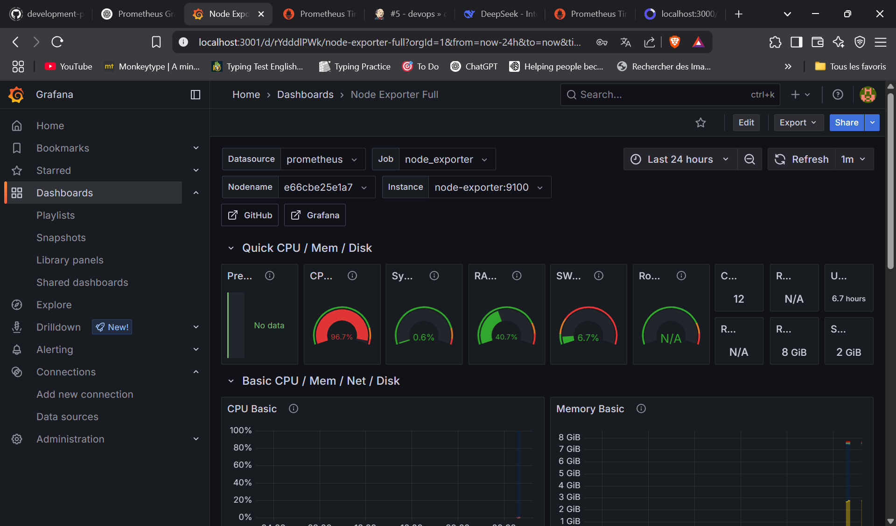
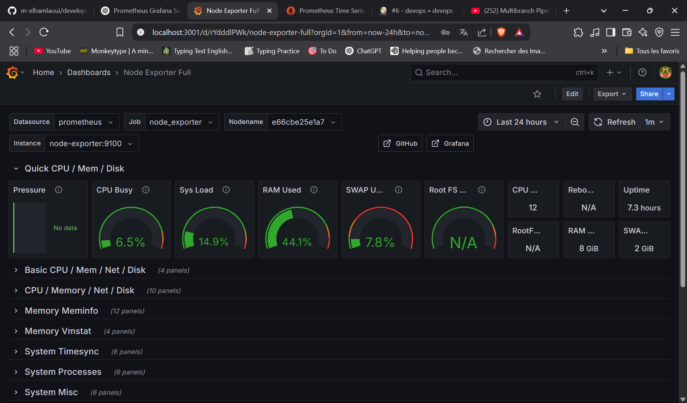
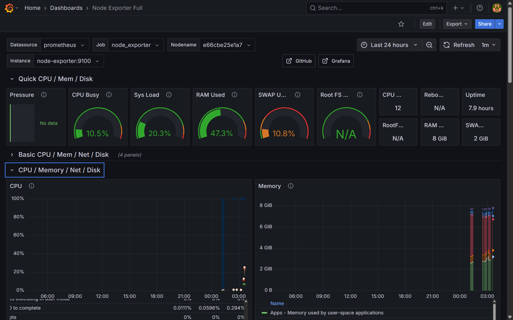
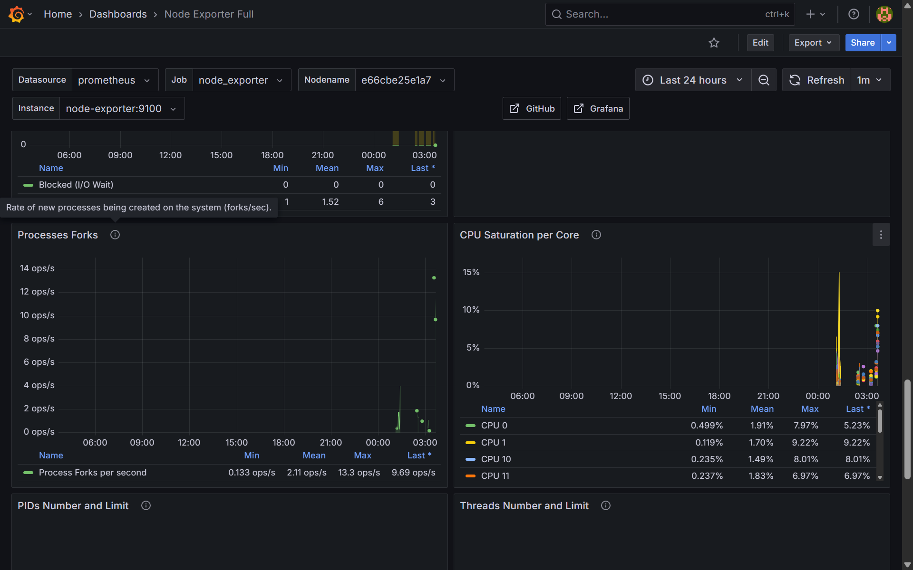
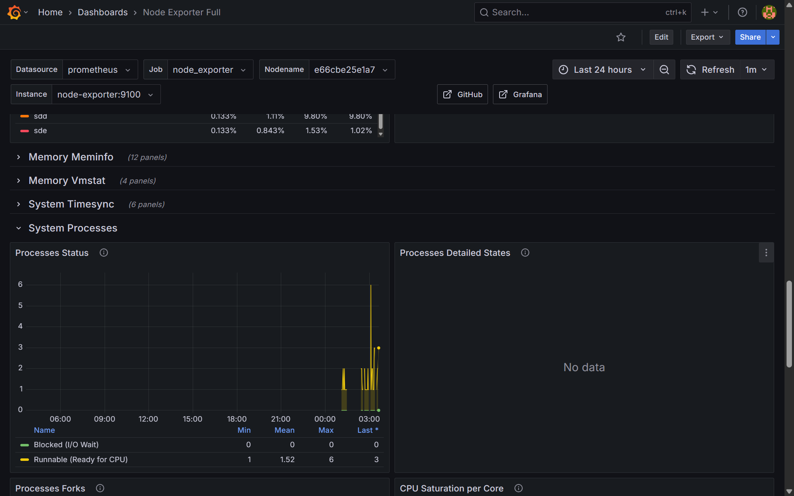
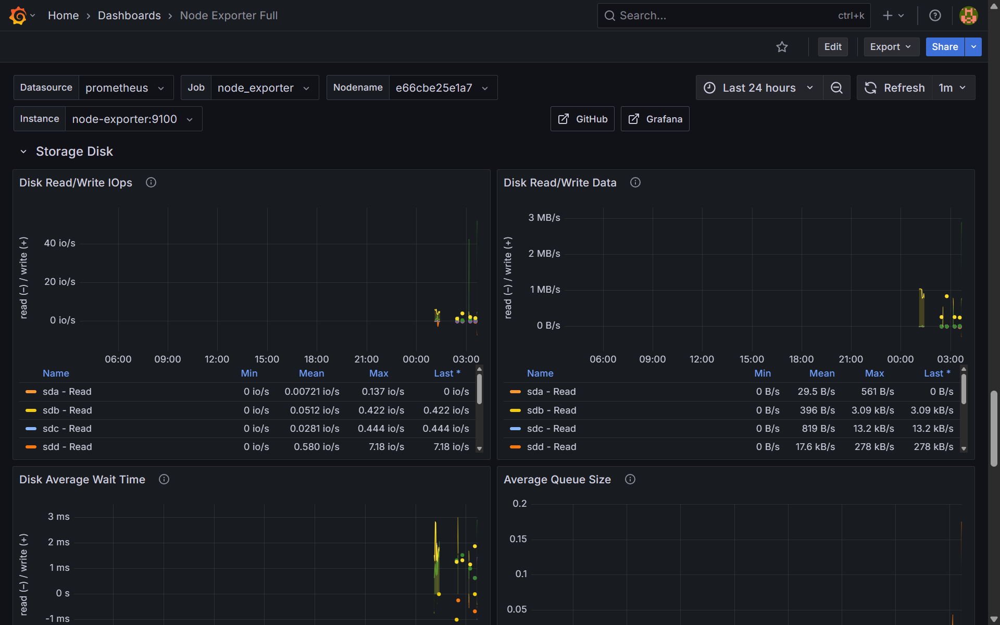

# 📦 DevOps Project for AstroFarmers — CI/CD, Monitoring, and Microservices Orchestration with Kubernetes (Minikube)

## 🔍 Project Objective

The goal of this project is to implement a complete DevOps pipeline for an application composed of microservices. It includes:


- A **Continuous Integration / Continuous Deployment (CI/CD)** pipeline using **Jenkins**.


- A **real-time monitoring** stack with **Prometheus** and **Grafana**.


- A **Kubernetes-based deployment** for scalability, orchestration, and resilience, using **Minikube**.

---

## 🏗️ 1. Setting up the CI/CD Pipeline with Jenkins

### 🐳 Step 1: Prepare Jenkins Environment

1. Clone the repository and navigate into the project:
   ```bash
   git clone <project_url>
   cd devops-project
   Build and run the Jenkins environment using Docker Compose:
   
   ```

   ```bash
   docker-compose -f docker-compose.jenkins.yml up --build
   ```

   (Optional) Run Jenkins manually in a container:

   ```bash
   docker run -p 8081:8080 -p 50000:50000 -v jenkins_home:/var/jenkins_home jenkins/jenkins:lts
   ```

### 🔐 Step 2: Configure Jenkins
1. Install the Docker Pipeline plugin from "Manage Jenkins > Manage Plugins".


2. Set up the necessary credentials:


- **_DockerHub credentials (username + access token)_**

- **_GitHub personal access token (username + access token)_**

- **_Kubeconfig file to allow Jenkins to communicate with the Kubernetes cluster_**


3. Create a new Jenkins job:


- **Type:** Pipeline or Multibranch Pipeline

- **Target branch:** devops


### ⚙️ Step 3: Run the Pipeline

Before triggering a build, open PowerShell as Administrator and run the following command:

   ```bash
   kubectl proxy --address='0.0.0.0' --port=8001 --accept-hosts='.*'
   ```

This allows Jenkins to interact with the Kubernetes API via a local proxy.

### 🔄 GitHub Webhook Integration with Jenkins

1. Download and install **ngrok**.


2. Start ngrok to expose Jenkins:


   ```bash
   ngrok http 8081
   ```

3. Copy the public ngrok URL and configure it as a webhook in your GitHub repository.


4. Install one of the following Jenkins plugins:


- Multibranch Webhook Trigger plugin

- or Generic Webhook Trigger plugin


5. Configure the webhook URLs:


- For Multibranch Pipeline:

   ```bash
   https://<ngrok_url>/multibranch-webhook-trigger/invoke?token=your-token
   ```


- For Single Pipeline:

   ```bash
   https://<ngrok_url>/generic-webhook-trigger/invoke?token=your-token
  
   ```




***Jenkins CI/CD Pipeline***

---

## 📊 2. Monitoring Stack with Prometheus and Grafana

### 📁 Folder Structure
The monitoring/ folder contains Docker Compose configurations for Prometheus and Grafana.

---

### ▶️ Launching Monitoring Services

1. Navigate to the folder:


   ```bash
   cd monitoring
   ```

2. Launch the stack:


   ```bash
   docker-compose up --build
   ```

---

### 🌐 Access the Monitoring Interfaces

- Prometheus: http://localhost:9090


- Grafana: http://localhost:3001


- Default credentials:

    - Username: admin

    - Password: admin (you will be asked to change it on first login)


---

### 🧩 Configure Prometheus as a Data Source in Grafana

1. Open Grafana UI.


2. Navigate to Configuration > Data Sources > Add Data Source.


3. Select Prometheus.


4. Enter the URL:

   http://prometheus:9090


5. Save and test the connection.


---

### 📈 Import Dashboards in Grafana


1. In Grafana, go to + **> Import**.


2. Import dashboards by:


- Providing an official ID from the Grafana dashboard repository:

    - Prometheus: **1860**

    - cAdvisor: **893**

    - Node Exporter Full: **1860**


- Or uploading a custom dashboard JSON file.


Once imported, dashboards will begin displaying metrics collected by Prometheus.


  

***Prometheus UI showing metrics***

  

***Grafana displaying imported dashboards***

  

***Grafana displaying imported dashboards***

 

***Grafana displaying imported dashboards***

  

***Grafana displaying imported dashboards***

 

***Grafana displaying imported dashboards***

 

***Grafana displaying imported dashboards***


---


### ✅ Verify Prometheus Targets

To ensure Prometheus is collecting data:


1. Open http://localhost:9090/targets


2. Confirm that all targets (Prometheus, cAdvisor, etc.) show Status: UP.


If a target is DOWN, review its configuration or check that the service is running.

---


## ☸️ 3. Deploying Microservices with Kubernetes (Minikube)

## 🧰 Prerequisites

Install Minikube and start your cluster:

   ```bash
   minikube start
   minikube addons enable dashboard
   minikube addons enable ingress
   minikube addons enable registry

   ```

---


## 🚀 Deployment Steps

1. Prepare the necessary Kubernetes YAML files (for deployments, services, ingress, configmaps, etc.).


2. Apply the configurations:


   ```bash
   microk8s kubectl apply -f k8s/

   ```


3. Verify that all pods are running:

   ```bash
   kubectl get pods
   
   ```


The microservices are now deployed and orchestrated by Kubernetes, ensuring scalability, load balancing, and high availability.


---

## Tools & Technologies Used

**- Jenkins**


**- Docker**


**- MicroK8s**


**- Prometheus**


**- Grafana**


**- Ngrok**


---

## 🖼️ Demo Video

   https://drive.google.com/file/d/10P_LyAc1l6Vc5kdSVhikMr5fnAlmYqxT/view?usp=sharing

---


## ✅ Conclusion


Through this project, we implemented a complete DevOps pipeline that:


- Automatically builds and deploys new versions using Jenkins


- Monitors health and performance in real-time with Prometheus and Grafana


- Deploys microservices using Kubernetes for robust and scalable orchestration


This setup showcases the application of modern DevOps principles to ensure reliability, observability, and continuous delivery of a microservice-based system.