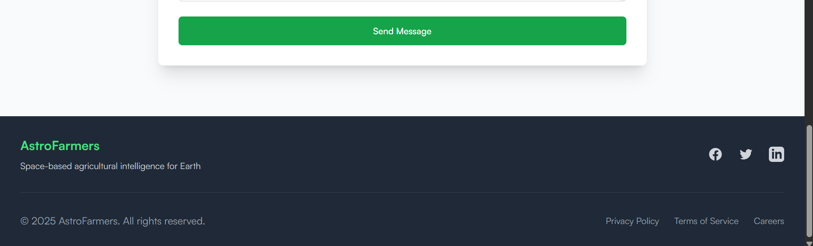
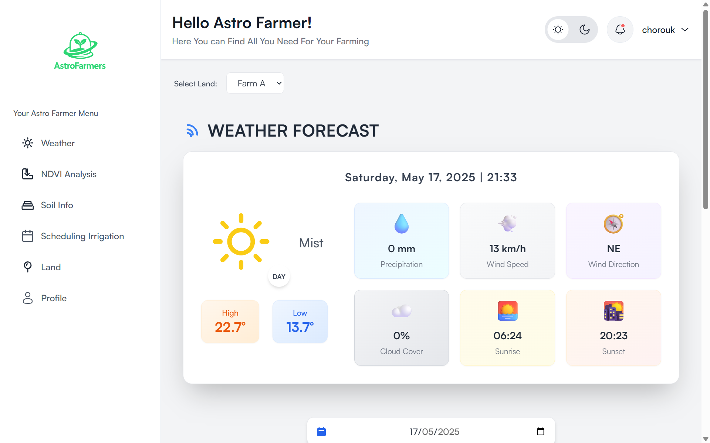
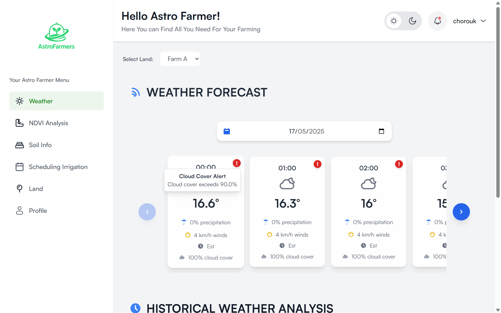

# 🚀 Space-Based Agricultural Monitoring & Prediction System

## 🌐 Project Overview

AstroFarmers is a web-based platform designed to support agricultural monitoring by visualizing satellite-derived weather data, crop health indicators (like NDVI), and soil moisture information. The system empowers farmers, researchers, and agricultural professionals by offering a clear, accessible view of environmental and agronomic conditions using remote sensing technologies.

---

## 🎯 Objectives

* Enable farmers to monitor crop health using NDVI imagery and satellite observations.

* Facilitate better water management through satellite-based soil moisture data.

* Improve agricultural risk awareness via real-time alerts for extreme weather events.

* Provide an accessible platform for data visualization in agricultural monitoring.

---

## 🔑 Key Features

### 🌍 Earth-Based Agriculture Optimization

* **Satellite Weather Integration**: Fetch real-time climate data (temperature, precipitation, radiation) from sources such as NASA, ESA, Sentinel-2, and NOAA.
* **Crop Growth Monitoring**: Use NDVI (Normalized Difference Vegetation Index) analysis to assess crop health based on satellite imagery.
* **Irrigation & Water Management**: Optimize irrigation schedules using soil moisture data derived from satellite sensors.
* **Extreme Weather Alerts**: Detect droughts, floods, and storms using space-based weather tracking and notify farmers in advance.

---

## 🧑‍💻 Getting Started

Follow these steps to set up and run the project locally:

### 1. Clone the Repository

```bash
git clone https://github.com/m-elhamlaoui/development-platform-astrofarmers.git
cd development-platform-astrofarmers
```


### 2. Backend Setup (Spring Boot)

* Create a `.env.properties` file inside `backend/src/main/resources`:

  ```env
  spring.application.name=backend
  spring.datasource.url=jdbc:postgresql://localhost:5432/agri_db
  spring.datasource.username=postgres
  spring.datasource.password=1234

  spring.jpa.hibernate.ddl-auto=update

  # === Alert Thresholds ===
  alert.thresholds.temperature=45
  alert.thresholds.wind-speed=70
  alert.thresholds.precipitation=50
  alert.thresholds.radiation=22
  alert.thresholds.cloud-cover=90

  ```

* Update the Nvdi Controller:

  ```bash
  BASE_DIR = "<your-absolute-path-to-the-project>/development-platform-astrofarmers/backend/"
  ```
---

### 3. Database Setup

- Ensure that **PostgreSQL** is installed and running.
- Create a database named `agri_db`.


Before running the backend, make sure the following roles exist in the `role` table:

| id | nom_role |
|----|----------|
| 1  | USER     |
| 2  | ADMIN    |

You can insert them manually using SQL:

```sql
INSERT INTO role (role_id, role_name) VALUES
(1, 'USER'),
(2, 'ADMIN');
```

### 4. Python Scripts

* Ensure Python 3.12+ is installed.

* Change the venv Configuration :

  ```bash
  cd script_python/venv
  ```

  Open the pyvenv.cfg and update it :
  ```bash
  home = <full_path_to_python_installation_directory>
  include-system-site-packages = false
  version = 3.12.2
  executable = <full_path_to_python_executable>
  command = <full_path_to_python_executable> -m venv <full_path_to_virtual_environment>
  ```


### 5. Frontend Setup (Next.js)

* Navigate to the frontend directory:

  ```bash
  cd frontend
  ```

* Install frontend dependencies:

  ```bash
  npm install
  npm install recharts
  npm install leaflet
  npm install chart.js react-chartjs-2
  npm install react-icons
  ```

* Start the frontend development server:

  ```bash
  npm run dev
  ```

* Open your browser and go to: [http://localhost:3000](http://localhost:3000)


---

## 🖼️ Overview

## User

### 🌾 Landing page


*Home Page.*
---

*Features Sum Up.*
---

*Contact Us.*
---

*Footer.*
---
### SignUp

---
### SignIn


---
### 🔔 Weather and Alerts

*Daily Weather.*
---

*Weather Forecast.*
---

*Historical Data.*
---


### 🚀 Satellite Imagery View


*Location Selection.*
---

*NDVI Analysis Result.*
---

*NDVI Analysis Result 2.*


---
### 📊 Soil Info

*Soil Moisture Details.*
---

*General Weather Info.*
---

*General Weather Info 2.*
---

*General Weather Info 3.*


---
### 🌾 Irrigation Schedule

*Irrigation Schedule Generation.*
---

*Irrigation Events.*
---

*Notifications Irrigation.*


--- 
### 🌾 Land

*Add Land.*
---

*See Lands.*


---

### Profile


*Change Username.*


---

## Admin 

*Crop Management.*
---

*Edit Existing CropType.*
---

*Add CropType.*

---

## 📁 Project Structure (Simplified Version)

```bash
.
├── backend/
│   ├── script_python/           
│   └── src/
│       └── main/
│           ├── java/            
│           └── resources/
│               ├── application.properties
│               └── .env.properties  
├── frontend/                              
├── images/   
└── README.md             
```

---

## ✅ Conclusion

**AstroFarmers** leverages satellite data and remote sensing to deliver practical insights for the agricultural sector. By focusing on visualization, the platform simplifies access to essential information such as crop conditions, irrigation schedules, and environmental alerts—helping users make informed decisions and manage their land more effectively.

---

test du github webhook
test 2 github webhook for jenkins
test 3 github webhook for jenkins
