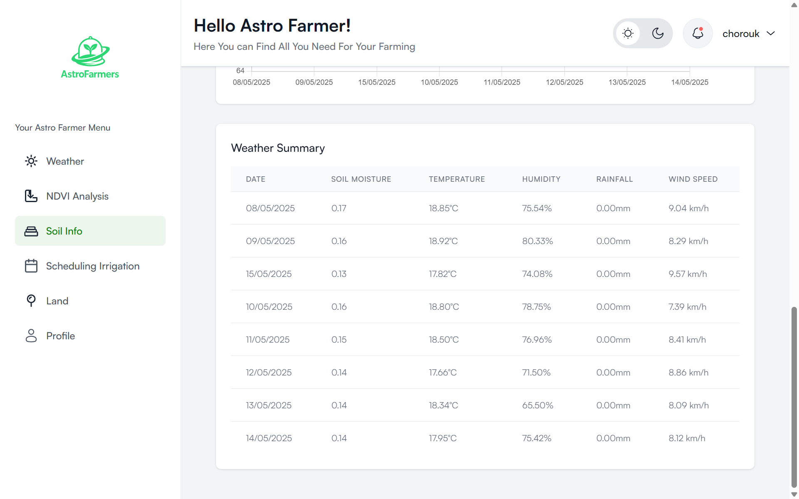

# 🚀 Space-Based Agricultural Monitoring & Prediction System

## 🌐 Project Overview

The Space-Based Agricultural Monitoring & Prediction System is a web-based platform designed to enhance agricultural efficiency on Earth by leveraging satellite weather data, machine learning, and remote sensing technologies. This system provides real-time insights to farmers, researchers, and agricultural organizations to optimize crop management and mitigate risks related to climate change.

---

## 🎯 Objectives

* Optimize farming practices by integrating satellite data and AI-driven analytics.
* Enhance climate resilience by predicting and mitigating environmental risks.
* Provide research tools for agricultural scientists through open APIs and data visualization.

---

## 🔑 Key Features

### 🌍 Earth-Based Agriculture Optimization

* **Satellite Weather Integration**: Fetch real-time climate data (temperature, precipitation, radiation) from sources such as NASA, ESA, Sentinel-2, and NOAA.
* **Crop Growth Monitoring**: Use NDVI (Normalized Difference Vegetation Index) analysis to assess crop health based on satellite imagery.
* **Irrigation & Water Management**: Optimize irrigation schedules using soil moisture data derived from satellite sensors.
* **Extreme Weather Alerts**: Detect droughts, floods, and storms using space-based weather tracking and notify farmers in advance.

---

## 🧑‍💻 Getting Started

Follow these steps to set up and run the project locally:

### 1. Clone the Repository

```bash
git clone https://github.com/m-elhamlaoui/development-platform-astrofarmers.git
cd development-platform-astrofarmers
```

### 2. Backend Setup (Spring Boot)

* Navigate to the backend directory:

  ```bash
  cd backend
  ```

* Create a `.env` file in the backend root (or set environment variables in your IDE or OS):

  ```env
  SPRING_DATASOURCE_URL=jdbc:postgresql://localhost:5432/agri_db
  SPRING_DATASOURCE_USERNAME=your_db_username
  SPRING_DATASOURCE_PASSWORD=your_db_password
  SPRING_JPA_HIBERNATE_DDL_AUTO=update
  ALERT_THRESHOLDS_TEMPERATURE=45
  ALERT_THRESHOLDS_WIND_SPEED=70
  ALERT_THRESHOLDS_PRECIPITATION=50
  ALERT_THRESHOLDS_RADIATION=22
  ALERT_THRESHOLDS_CLOUD_COVER=90
  ```

* Update the Nvdi Controller:

  ```bash
  BASE_DIR = "<your-absolute-path-to-the-project>/development-platform-astrofarmers/backend/"
  ```

> Ensure that PostgreSQL is installed and running, and the database `agri_db` exists.

---

### 3. Frontend Setup (Next.js)

* Navigate to the frontend directory:

  ```bash
  cd frontend
  ```

* Install frontend dependencies:

  ```bash
  npm install
  npm install recharts
  npm install leaflet
  npm install chart.js react-chartjs-2
  npm install react-icons


  ```

* Start the frontend development server:

  ```bash
  npm run dev
  ```

* Open your browser and go to: [http://localhost:3000](http://localhost:3000)

---

### 4. Python Scripts 

If your project uses Python scripts for ML processing:

* Ensure Python 3.12+ is installed.

* Change the venv Configuration :

  ```bash
  cd script_python/venv
  ```
  
  Open the pyvenv.cfg and update it :
  ```bash
  home = <full_path_to_python_installation_directory>
  include-system-site-packages = false
  version = 3.12.2
  executable = <full_path_to_python_executable>
  command = <full_path_to_python_executable> -m venv <full_path_to_virtual_environment>

  ```


---

## 🖼️ Overview

## User

### 🌾 Landing page


*Home Page.*
---

*Features Sum Up.*
---

*Contact Us.*
---

*Footer.*
---
### SignUp

---
### SignIn


---
### 🔔 Weather and Alerts

*Weather Forecast.*
---

*Historical Data.*
---


### 🚀 Satellite Imagery View


*Location Selection.*
---

*NDVI Analysis Result.*
---

*NDVI Analysis Result 2.*


---
### 📊 Soil Info

*Soil Moisture Details.*
---

*General Weather Info.*
---

*General Weather Info 2.*
---

*General Weather Info 3.*


---
### 🌾 Irrigation Schedule

*Irrigation Schedule Generation.*
---

*Irrigation Events.*
---

*Notifications Irrigation.*


--- 
### 🌾 Land

*Add Land.*
---

*See Lands.*


---

### Profile


*Change Username.*


---

## Admin 

*Crop Management.*
---

*Edit Existing CropType.*
---

*Add CropType.*

---

## 📁 Project Structure (Example)

```bash
.
├── backend/               # Spring Boot API and services
│   └── src/
├── frontend/              # React or Angular frontend
│   └── src/
├── script_python/         # ML or data processing scripts (optional)
│   ├── venv/
│   └── process_data.py
├── .env                   # Environment configuration
└── README.md              # Project documentation
```

---

## ✅ Conclusion

The **Space-Based Agricultural Monitoring & Prediction System** harnesses satellite data, machine learning, and remote sensing to empower stakeholders in agriculture. It helps improve productivity, optimize resources, and proactively manage climate-related challenges.

---

